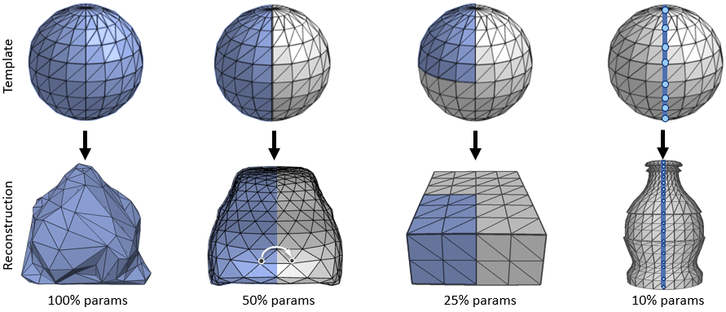
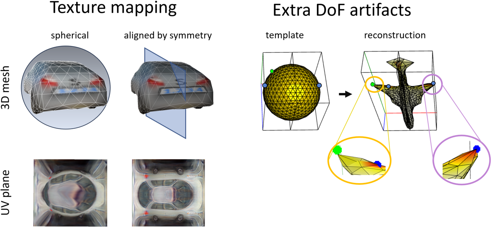
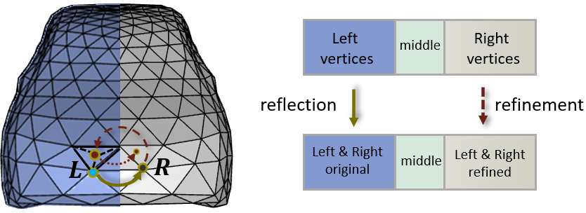
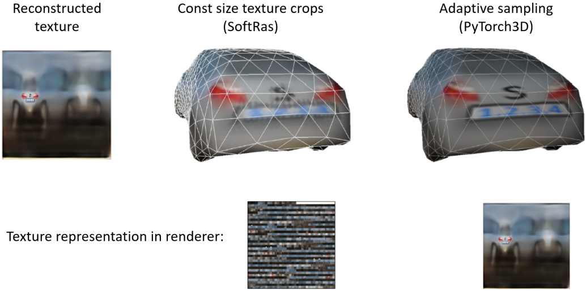
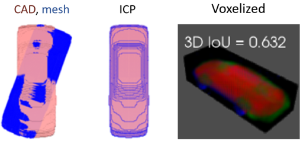
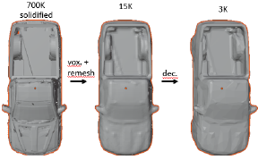
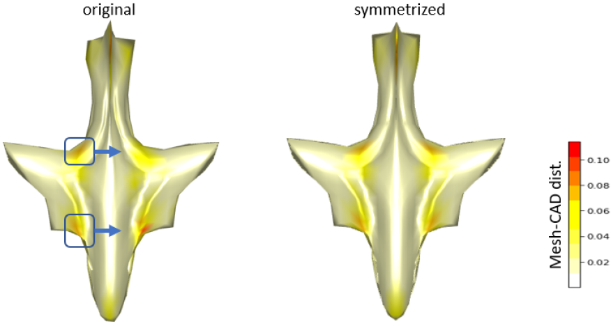

# Learning Shape Symmetries for 3D Mesh Reconstruction with Differentiable Rendering

 ##### This repository demonstrates how learning *Shape Symmetries*  and properly configuring  *Differentiable Rendering* improves 3D reconstruction networks.
 **[[Slides](https://alexnaitsat.github.io/html/projects/mesh_reconstruction/symmetries_UV_for_reconstruction.pdf)]** &nbsp; **[[Paper](https://alexnaitsat.github.io/html/projects/mesh_reconstruction/symmetries_UV_for_reconstruction.pdf)]** 
 > Check out [here](https://github.com/AlexNaitsat/UVmap_pix2surf)  the related method of *Learnable UV-maps*   

## Learnable Shape Symmetries
Image-to-3D reconstruction neural networks are essential for various applications (robotics, AR, autonomous driving, AI retail solutions). However, many existing networks often overlook real-world object features, such as rotation/reflection symmetries. This results in lower accuracy, induces various artifacts and makes network training more difficult because outputs are represented inefficiently with excessive degrees of freedom.
Based on this, we propose an approach that:

* **detects object symmetry** types and selects the corresponding **optimal 3D representation** for detailed reconstruction with fewer network parameters and faster training.
* introduces a robust scheme applicable to **various types** of symmetries and neural networks, including networks with  minimal input data (single-view RGB, occluded images)
* enables significant **increase in output resolution** of pretrained networks by adjusting their loss functions alone
* **repairs artifacts** of existing networks caused by redundant 3D representations 
* **preserves well texture details** of reconstructed objects by aligning their  UV-maps with the symmetry axis. 

### Leveraging symmetries to reduce the number of training parameters
Symmetrical objects can be encoded with less data  than asymmetrical ones




### Leveraging symmetries to improve texture and repair surface artifacts
Texture quality depends heavily on how surface is unfolded onto the UV-plane (e.g. spherical parametrization vs surface cut through its symmetry plane). Extra DoF often result in  surface tearing  and lack of smoothness.




## Implementation
Current implementation  supports *single-view RGB* images as input and *textured triangle meshes* with *reflection symmetry* as output. It's built on top of the Multi-Category Mesh Reconstruction network ([MCMR](https://github.com/aimagelab/mcmr)) with the following major improvements:

* **Reflection scheme** to improve 3D accuracy and repair mesh artifacts of the baseline network. 
* **Refinement scheme** to **double output resolution**, while maintaining the same number of learnable parameters.
* **[PyTorch3D](https://pytorch3d.org/)   differentiable renderer** integrated with backbone network  (instead of [SoftRas](https://github.com/ShichenLiu/SoftRas)) to improve texture and 3D details.

* **Additional utilities** for better visualization and  more accurate evaluation of geometric errors.

### Schemes for reflection and mesh refinement 
It requires only redefinition of 3D losses and fine-tuning (same architecture and same number of parameters)



### Optimal mode for differentiable rendering 
Choosing the right differential renderer has a significant impact on the network's ability to recover surface detail and texture.
* Sampling texture crops of fixed sizes for all  triangle results in detail loss  (SoftRas)
* To preserve details,  textures  should be sampled adaptively based on sizes of rendered triangles (Phong shading in Pytorch3D)




### Additional Utilities
New  visualization and geometry processing utilities to better evaluate the results, scripts for automation and wider test/train capabilities:


| location             |  description   | visual examples  |
| :-----------------------|:---------------------------------------------------------------------------|:-----:|
| ``utils/geometry.py``  | 3D metrics: Hausdorff \& minmax distances, index \& geometry symmetries, 3D IoU. Transformations: ICP and PCA (various versions), volume voxelization, mesh subdivisions |   |
| ``Blender/``           | Blender project with integrated script to clean CAD meshes for better 3D error evaluation | |
| ``notebook/`` | Various features for interactive visualization (``meshplot_utils.py``) and   notebook examples        |    |
| ``scripts/`` |  Bash scripts for automatic setup and for running  test/training pipelines with optimized configurations for different network types   |    |


## Getting Started
### Automatic installation
For automatic setup on Ubuntu, [prepare data](https://github.com/aimagelab/mcmr/blob/main/datasets/DATASET.md)  and  run

```bash
   bash ./scripts/install_requirements.sh 
   bash ./scripts/install_additional_packages.sh

   #use link to the dataset you pre-processed or the one you received from the authors
   bash ./scripts/download_data.sh   
   bash ./scripts/download_weights.sh
```
For manual setup, follow these steps: 

### 1. MCMR dependencies 
Follow [these instructions](https://github.com/aimagelab/mcmr/tree/main?tab=readme-ov-file#getting-started) to setup  environment and  prepare dataset for the backbone [MCMR](https://github.com/aimagelab/mcmr) network ([PyTorch](https://pytorch.org/)/[torchvision](https://pytorch.org/vision/stable/index.html), [Softras](https://github.com/ShichenLiu/SoftRas),  [Pascal3D+](https://github.com/aimagelab/mcmr/blob/main/datasets/DATASET.md#pascal3d))

### 2. PyTorch3D renderer 

Install [PyTorch3D](https://pytorch3d.org/) v0.4.0 

```bash
conda install -c bottler nvidiacub
pip install fvcore iopath
pip install "git+https://github.com/facebookresearch/pytorch3d.git@v0.4.0"
```
### 3. **Optional:** additional utilities    
* Install [Blender v2.81](https://www.blender.org/download/releases/2-81/) to run ``cad_processing_pipeline.py`` script for preprocessing of ground truth CAD meshes
* Install [libigl](https://libigl.github.io/) and [PyVista](https://docs.pyvista.org/version/stable/) package  for 3D alignment and evaluation of additional geometric measures
```bash
conda activate <env_name>            # environment for MCMR dependencies
conda install -c conda-forge igl     # libigl for surface error metrics 
conda install -c conda-forge pyvista # for 3D IoU
```
* Install [meshplot](https://skoch9.github.io/meshplot/) package for advanced visualization by running   ```conda install meshplot ```, or (recommended  for Jupyter): 
``` bash conda deactivate 
conda create --name <env_name_clone> --clone <env_name> # install package in cloned environment 
conda source  <env_name_clone>                          # to avoid python/ipython discrepancies 
conda install ipykernel                                         
pip install --upgrade jupyter_client 
conda install -c conda-forge meshplot 
```


## Training
The simplest way to train network is to run the wrapper script:
```bash 
bash scripts/train_mcmr_pascal3d.sh  <weights> <mean_shapes_number> <class_list> <data_index_name> <options>
```
| argument                | explanation |
| :-----------------------|:-----------|
| weights | file for weight initialization (e.g. backbone pretrained weights) |
| mean_shape_number | (optional) configurations for the backbone network (usually, it's number of classes from training data, or 1 ) |
| class_list| list of object classes from Pascal3D (e.g. `aeroplane car`) |
|data_index_name |  (optional)  name of the data index file to sample a subset of the training data |
|options | Additional command line arguments passed to the training script (`main.py`), **including**   `--symmetrize` flag to **enable learnable symmetries** |

Examples of training without learnable symmetries:
```bash 
bash scripts/test_mcmr_pascal3d.sh car_10_MRCNN 10  car  small --qualitative_results
bash scripts/train_mcmr_pascal3d.sh plane_car_1_PointRend   "aeroplane car" small ""
```
Example of  training with learnable symmetries (reflection scheme): 
``` 
bash scripts/train_mcmr_pascal3d.sh plane_car_1_PointRend   "aeroplane car" small --symmetrize
```
There are other training scripts in `script` folder named  `train_<class_list>_symmetric.sh`  and  `train_<class_list>_not_symmetric.sh` to train symmetrized and non-symmetrized networks with various configurations.

## Testing
The simplest way to test network is to run the wrapper script:
```bash 
bash scripts/test_mcmr_pascal3d.sh  <weights> <mean_shapes_number> <class_list> <data_index_name> <options>
```
* where command line arguments are the same as during the training 

Examples:
```bash 
 bash scripts/test_mcmr_pascal3d.sh car_10_MRCNN 10  car  small --qualitative_results
 bash scripts/test_mcmr_pascal3d.sh plane_car_1_PointRend 1  "aeroplane car" small
```

After testing baseline networks, you can estimate how much improvements can be achieved with  learnable symmetries for these networks by running: 
```bash 
python auxilary/test_postprocessing_par.py
```
For more tests on  how learning  symmetries impacts various pretrained networks, check out ``scripts/test_symmetrizations.sh`` 


## Additional Resources  
While the code is designed for classical Encoder-Decoder networks, the proposed method is also applicable to other reconstruction methods, including NERFs and neural rendering methods for generating novel views. 
Further methods for generalization and improvements include direct supervision of UV-map quality and  texture symmetrization. 
For details explore the following resources:


 **[[Learning UV-maps repo](https://github.com/AlexNaitsat/UVmap_pix2surf)]** &nbsp; **[[MCMR paper](https://arxiv.org/abs/2110.11256)]** &nbsp;  **[[Novel View Neural Rendering](https://arxiv.org/pdf/2106.06533)]**   &nbsp;  **[[PyTorch3D Renderer](https://pytorch3d.org/tutorials/render_textured_meshes)]** 


## Citation
  Consider citing this work if you find it useful
```
@misc{naitsat2023,
  author = {Naitsat, A.},
  title = {Learning Shape Symmetries for 3D Mesh Reconstruction with Differentiable Rendering},
  howpublished = {\url{https://github.com/AlexNaitsat/symmetric_mcmr}},
  }
```


## License
This project is licensed under the MIT License - see the [LICENSE](LICENSE) file for detail

